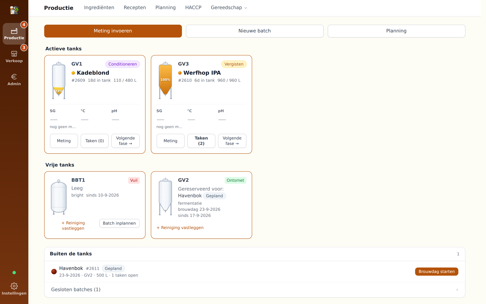
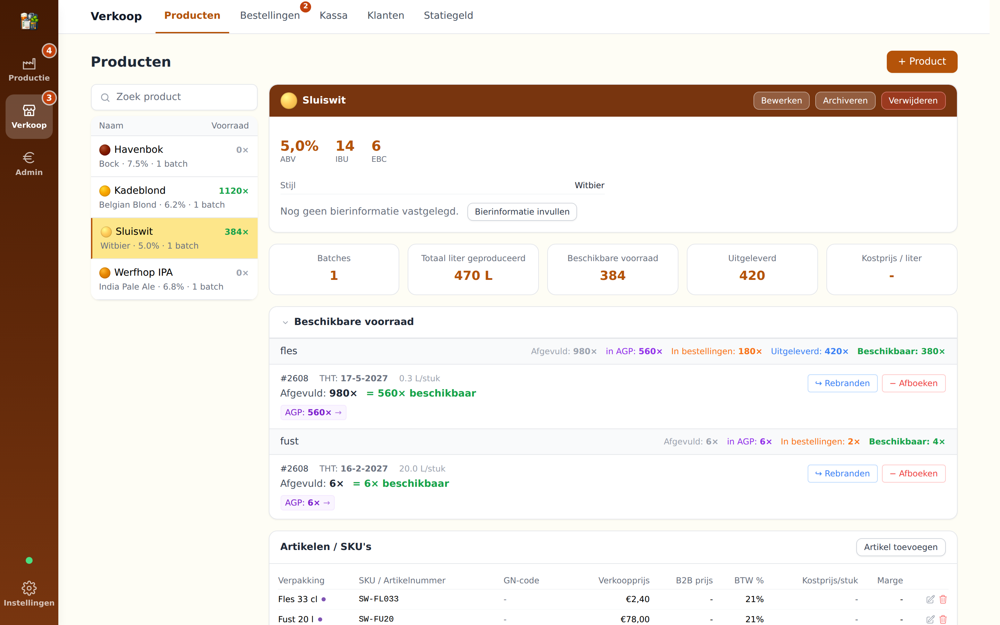
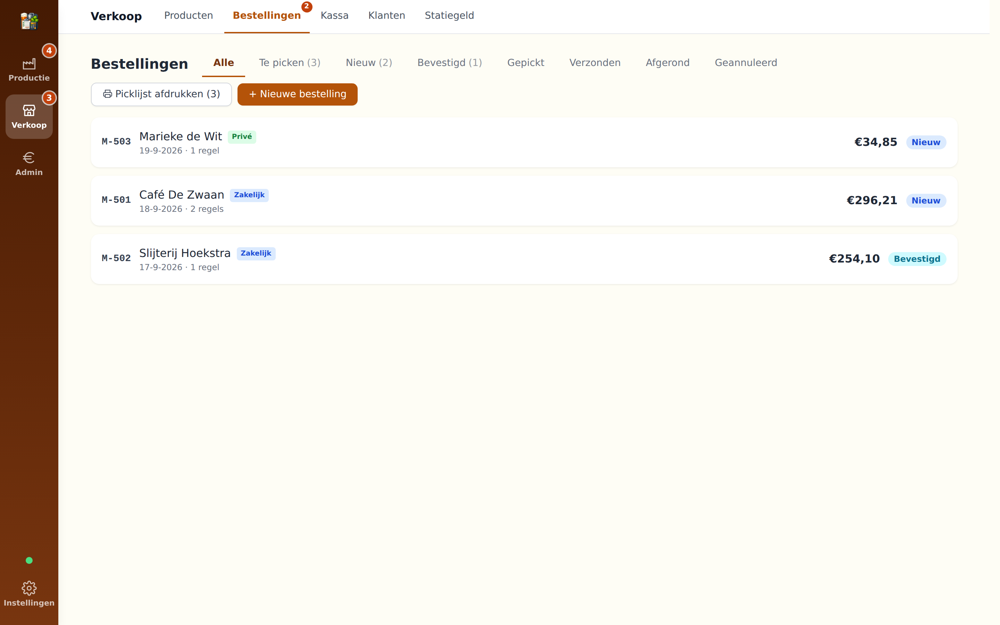
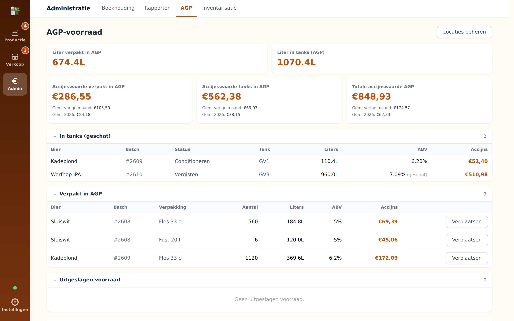
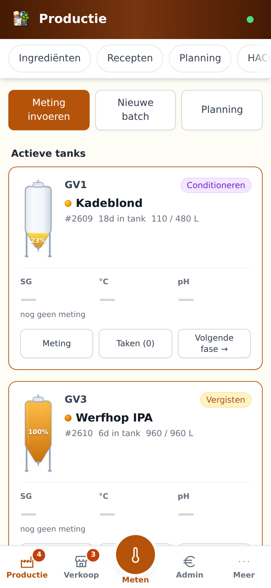

# BrewAdmin

A Home Assistant addon for running a small brewery. Batches and tanks, ingredients
and lots, packaged beer and excise duty, orders and invoices, HACCP records and
accounting — in one place, inside your own Home Assistant.

Built for Dutch excise and VAT rules (AGP, accijnsaangifte, btw-aangifte) and for
the NVWA hygiene handbook. Interface available in Dutch, English, German, French
and Spanish.

[](https://my.home-assistant.io/redirect/supervisor_add_addon_repository/?repository_url=https%3A%2F%2Fgithub.com%2Fjasperbom%2FBrewAdmin-HA-App)

Or add the repository by hand in **Settings → Add-ons → Add-on Store → ⋮ →
Repositories**:

```
https://github.com/jasperbom/BrewAdmin-HA-App
```

> The screenshots below use a fictional brewery. No real brewery data is included
> in this repository.

---

## The brewhouse

Every tank is a card: what is in it, how long, the last measurement, and the next
step. Free tanks show their cleaning status and can be planned straight away.



- Batch flow from planned through brewing, fermenting, conditioning and packaging
- Brew day wizard with measurements, hop additions, cooling log and efficiencies
- Tank occupancy and cleaning status; a dirty tank blocks the next batch
- Fermentation monitoring against the real setpoint of the linked cooling, with
  alarms for drift and sensor silence
- Planning board: drag a batch to another day or another tank
- Ingredients with lots, prices and best-before dates; recipes sync from Brewfather

## Sales

Products, articles and SKUs, with what each beer costs and what it earns.



- Webshop orders import from WooCommerce, including payment and delivery status
- Picking per order, oldest best-before first, with packing slip and invoice
- Point of sale for direct sales, till receipt included
- Customers, deposits and merchandise
- Product cards push back to WooCommerce; beer information stays in the
  administration, not in the shop



## Administration

Excise stock (AGP) per location, with the duty value of what is in the tanks and
what is packaged.



- Excise calculated on release, per month declared and tracked to payment
- Purchase invoices scanned by Claude AI: supplier, date, number and lines
- VAT return per quarter or month, with the journal behind it
- Bank reconciliation from MT940, including payment service provider payouts
- Sales invoices as PDF or as UBL/PEPPOL e-invoice, with an optional Mollie
  payment link
- Stock counts, stock flow reports and a referential health check

## On a phone

The same app, one shell: three workspaces in the bottom bar, the page menu above
it. A badge opens what needs attention right now.



## HACCP

The hygiene handbook is part of the app, not a separate binder.

- CCP 1 release before packaging: stability, forced fermentation, sensory check
- CCP 2 seal checks per packaging session, CCP 3 label and allergen check
- Cleaning schedule and log, water samples, pest control, training records
- Lot codes and best-before dates per packaging session
- Traceability one step back and one step forward, mass balance, recall exercises
- Registrations are append-only: who and when are recorded automatically

---

## Installation

1. Add the repository with the button above, or by hand.
2. Install **BrewAdmin** from the add-on store.
3. Start the addon and open the web interface from the sidebar.

No configuration is required to get going. Brewfather, WooCommerce, Claude AI,
Mollie and SMTP are all optional and configured under Settings → Integrations.

### Options

| Option | Default | What it does |
|---|---|---|
| `ssl` | `false` | Serve the direct-access port over HTTPS with certificates from `/ssl`. An unusable certificate stops that port from starting rather than falling back to plain HTTP |
| `certfile` | `fullchain.pem` | Certificate inside `/ssl` |
| `keyfile` | `privkey.pem` | Private key inside `/ssl` |

Port `8098` adds access outside the Home Assistant sidebar, for a phone on the
same network or your own domain. It is switched off until you give it a host port
in the addon's network settings, and it always asks for a Home Assistant login.

## Your data

Everything lives in one SQLite database inside the addon (`/data/brewadmin.db`),
so it is covered by your regular Home Assistant backups.

On top of that the addon keeps its own daily backups with a seven-year retention,
matching the Dutch bookkeeping obligation, and writes an append-only audit trail
of every change. Under Settings → App you can make a backup on the spot, download
one, and restore a single data set from a backup without touching the rest of the
administration. A full export and import as Excel is available in the same place.

## Roles

Users of your Home Assistant can be given a role: admin, accounting, production or
read-only. The server enforces it, not just the interface.

---

## Development

```bash
npm install
npm run dev        # frontend at http://localhost:5173
python3 server.py  # backend at http://localhost:8099

npm test           # frontend unit tests
python3 -m pytest  # server tests
npm run typecheck  # tsc, strict on src/utils
npm run build      # single-file bundle to dist/index.html
```

React 18 with TypeScript and Tailwind, bundled by Vite into a single HTML file.
The backend is one Python file using only the standard library. See `CLAUDE.md`
for the architecture and the conventions used throughout.

This app was built with Claude AI.

## Licence

[AGPL-3.0](LICENSE)
